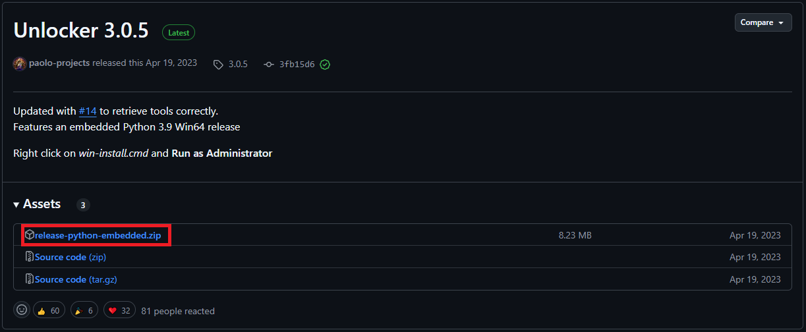

# Prérequis

Avant de commencer, assurez-vous de disposer des éléments suivants :

1. **VMware Player / Workstation Pro** : Vous pouvez télécharger et installer VMware Player ou Workstation Pro. Des tutoriels en ligne sont disponibles pour vous guider à travers l'installation de VMware Workstation Pro, y compris des solutions gratuites.
   
2. **VMware Unlocker** : Unlocker permet d'installer macOS dans VMware de manière plus native. Il est essentiel pour que VMware prenne en charge macOS en tant que système invité.

   Pour cela, téléchargez [Unlocker](https://github.com/paolo-projects/unlocker/releases/tag/3.0.5).

   

   Une fois téléchargé, exécutez le fichier **win-install.cmd** en tant qu'administrateur pour déverrouiller la prise en charge de macOS dans VMware.

3. **L'ISO de macOS** : Vous aurez besoin de l'ISO de la version de macOS que vous souhaitez installer sur VMware. Assurez-vous d'avoir téléchargé l'ISO de la version de macOS (dans ce guide, macOS Monterey 12 est utilisé).

4. **VMware Tools** : VMware Tools permet d'obtenir tous les pilotes nécessaires pour la machine virtuelle (meilleure gestion de la souris, optimisation des performances, etc.). 

   Pour installer VMware Tools, téléchargez le fichier **darwin.iso** qui est présent dans le répertoire correspondant. Ce fichier est nécessaire pour permettre à macOS de fonctionner de manière optimale sur VMware.

5. **Clover Configurator** : Ce logiciel permet de configurer certains aspects de macOS après l'installation, notamment pour rendre le Mac App Store fonctionnel. Vous pourrez l'utiliser une fois macOS installé pour ajuster des paramètres clés tels que les numéros de série et l'activation des services.

---

Avec ces éléments en main, vous serez prêt à suivre les étapes de création et d'installation de la machine virtuelle macOS sur VMware avec un processeur AMD.
