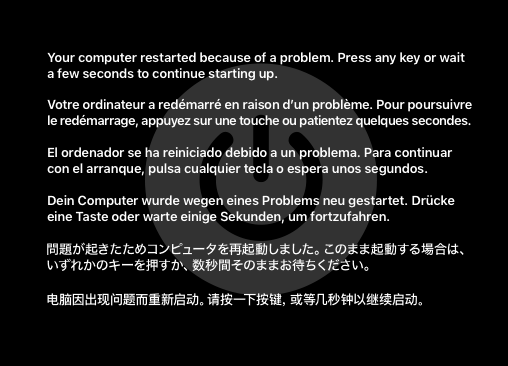

# BIOS
Activez la virtualisation du processeur dans le BIOS (cela varie en fonction de chaque carte mère, vous pouvez consulter des guides en ligne pour savoir comment l'activer).

# Windows
* Dans **Panneau de configuration** > **Désinstaller un programme** > **Activer ou désactiver des fonctionnalités Windows**, cochez **Plateforme de l'hyperviseur Windows**.  
* Ouvrez un terminal de commande en tant qu'administrateur, puis tapez la commande suivante : **bcdedit /set hypervisorlaunchtype auto**.  
* Redémarrez l'ordinateur.  
  
**Remarque :**  
Cela n'est pas obligatoire. J'ai même remarqué que, lorsque l'hyperviseur Windows est désactivé, la VM fonctionnait de manière plus fluide. Cependant, cela permet d'éviter le problème suivant :  

### Pour le désactiver :  
* Dans **Panneau de configuration** > **Désinstaller un programme** > **Activer ou désactiver des fonctionnalités Windows**, décochez **Hyper-V** et **Plateforme de l'hyperviseur Windows**.  
* Ouvrez un terminal de commande en tant qu'administrateur, puis tapez la commande suivante : **bcdedit /set hypervisorlaunchtype off**.  
* Redémarrez l'ordinateur.
