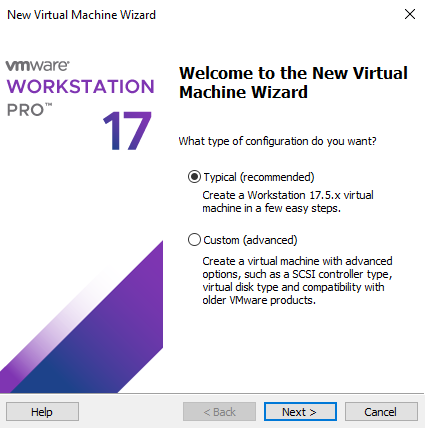
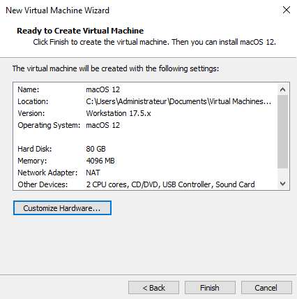

# Création de la machine virtuelle
Ouvrez VMware.
  
**File** > **New Virtual Machine...**
  
Choisissez **Typical (recommended)**, puis cliquez sur **Suivant**.
  

  
Sélectionnez **I will install the operating system later**.
  

  
Sélectionnez **Apple Mac OS X** dans `Guest operating system` et choisissez **macOS 12** dans `Version`.
  

  
Dans `Virtual machine name :` choisissez le nom de la VM, **macOS 12** est le nom par défaut. Dans `Location :`, choisissez le dossier dans lequel sera créée la VM, sinon laissez par défaut.
  

  
Dans `Maximum disk size (GB) :`, choisissez la taille du disque pour la VM, la taille recommandée et par défaut est de **80.0 GB**.  
Sélectionnez ensuite **Store virtual disk as a single file** pour plus de performances.
  

  
Cliquez sur **Customize Hardware...**.
  

  
Dans **Memory**, sous `Memory for this virtual machine :`, choisissez au minimum **4096 MB**.
  

  
Dans **Processors** :
* `Number of processors :` laissez impérativement à **1**.
* `Number of cores per processor :` choisissez au minimum **4**.
* `Virtualize Intel VT-x/EPT or AMD-V/RVI` : laissez décoché.
* `Virtualize CPU performance counters` : laissez décoché.
  

  
Dans **New CD/DVD (SATA)** :
* `Device status` : cochez **Connect at power on**.
* `Connection` : cochez **Use ISO image file**, cliquez sur **Browse...** et sélectionnez le fichier ISO de macOS.
  

  
Dans **Network Adapter** :
* `Device status` : cochez **Connect at power on**.
* `Network connection` : cochez **NAT : Used to share the host's IP address**.
  

  
Dans **USB Controller**, dans `USB compatibility :`, sélectionnez **USB 3.1**.
  

  
Dans **Sound Card**, sous `Device status` : cochez **Connect at power on**, les autres paramètres sont à choisir en fonction de vos préférences.
  

  
Dans **Display** :
* `3D graphics` : laissez impérativement **Accelerate 3D graphics** décoché.
* `Monitors` : cochez **Use host setting for monitor**.
  

  
Cliquez sur **Close**.
  
Cliquez sur **Finish**.
  

  
Fermez VMware, puis rendez-vous dans le dossier de la VM, que l'on peut retrouver ici :
  

  
Une fois dans le dossier de la VM, ouvrez le fichier `.vmx` à l'aide d'un éditeur de texte.  
Ajoutez ces lignes :  
  
`smc.version = "0"`  
`cpuid.0.eax = "0000:0000:0000:0000:0000:0000:0000:1011"`  
`cpuid.0.ebx = "0111:0101:0110:1110:0110:0101:0100:0111"`  
`cpuid.0.ecx = "0110:1100:0110:0101:0111:0100:0110:1110"`  
`cpuid.0.edx = "0100:1001:0110:0101:0110:1110:0110:1001"`  
`cpuid.1.eax = "0000:0000:0000:0001:0000:0110:0111:0001"`  
`cpuid.1.ebx = "0000:0010:0000:0001:0000:1000:0000:0000"`  
`cpuid.1.ecx = "1000:0010:1001:1000:0010:0010:0000:0011"`  
`cpuid.1.edx = "0000:0111:1000:1011:1111:1011:1111:1111"`  
`smbios.reflectHost = "TRUE"`  
`efi.inject64 = "true"`  
`efi.compatibility = "true"`  
`hw.model.reflectHost = "FALSE"`  
`hw.model = "iMacPro1,1"`  
`board-id = "Mac-7BA5B2D9E42DDD94"`  
  
N'oubliez pas de bien sauvegarder le fichier `.vmx` une fois ces lignes ajoutées.