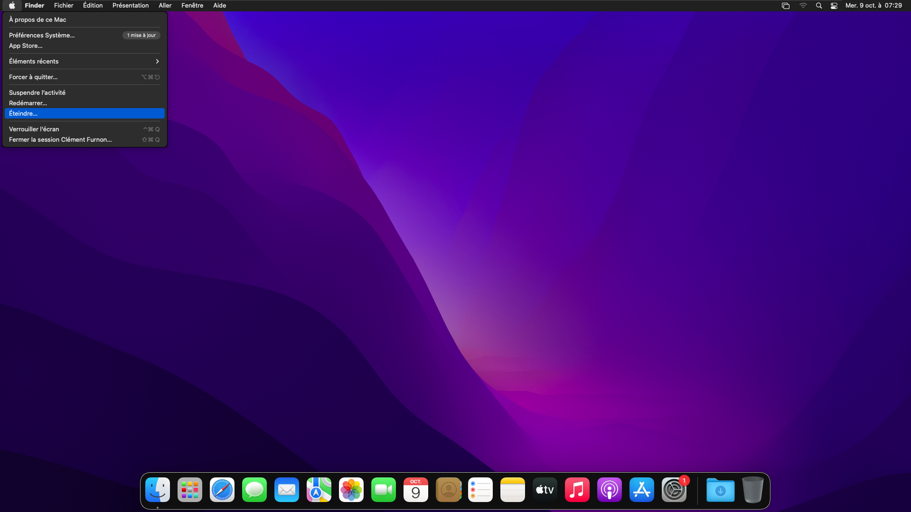

# Installation de VMware Tools
Faites un clic droit sur **Install macOS Monterey**, puis **Éjecter "Install macOS Monterey"**.
  

  
Faites un clic droit sur le logo Apple, puis sélectionnez **Éteindre**.
  

  
Une fois de retour sur VMware, cliquez sur **Edit virtual machine settings**.
  

  
Dans **CD/DVD (SATA)**, cliquez sur **Browse**, puis recherchez le fichier `darwin.iso`.
  

  
Fermez la fenêtre, puis démarrez la machine virtuelle.
  

  
Lancez **VMware Tools**.
  

  
Cliquez sur **Installation de VMware Tools**.
  

  
Cliquez sur **Continuer**.
  

  
Cliquez sur **Installer**.
  

  
Entrez le mot de passe, puis cliquez sur **Installer le logiciel**.
  

  
Cliquez sur **Ouvrir les préférences Sécurité**.
  

  
Cliquez sur le cadenas verrouillé.
  

  
Entrez le mot de passe, puis cliquez sur **Déverrouiller**.
  

  
Cliquez sur **Autoriser**.
  

  
Cliquez sur **Plus tard**.
  

  
Cliquez sur **Redémarrer**.
  

  
Une fois la VM redémarrée, faites un clic droit sur **VMware Tools**, puis sélectionnez **Éjecter "VMware Tools"**.
  

  
Faites un clic droit sur le logo Apple, puis sélectionnez **Éteindre**.
  

  
Une fois de retour sur VMware, cliquez sur **Edit virtual machine settings**.
  

  
Dans **CD/DVD (SATA)**, cliquez sur **Remove**.
  

  
VMware Tools est maintenant installé. Une fois la VM démarrée, vous pouvez passer en plein écran.  
  
**Avant :**
  

  
**Après :**
  

