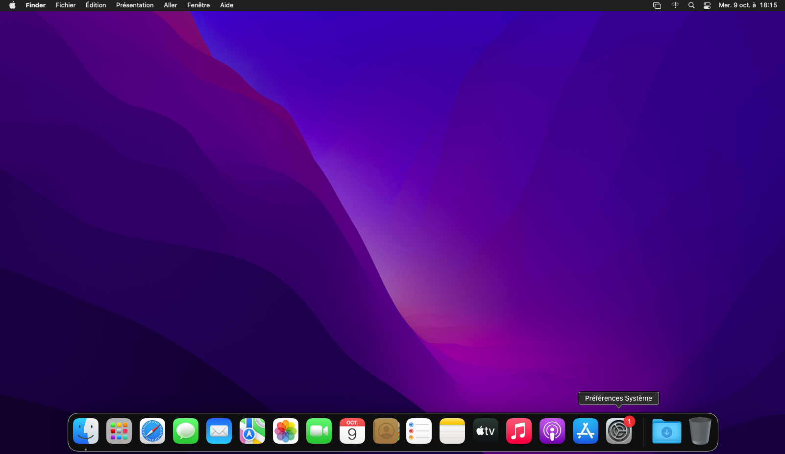
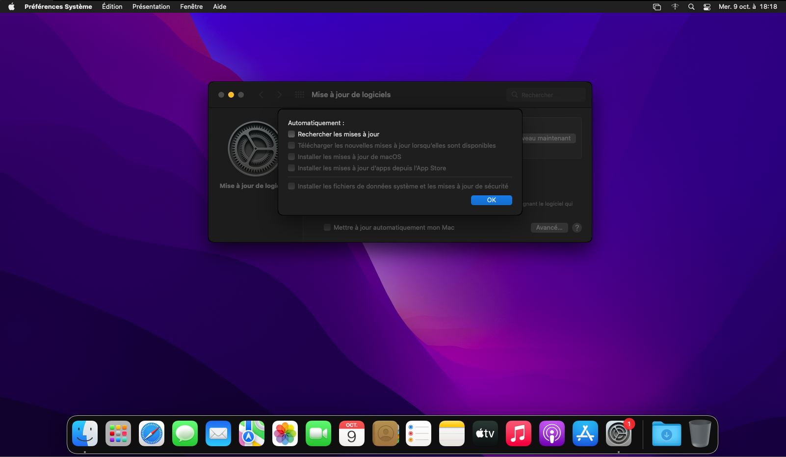
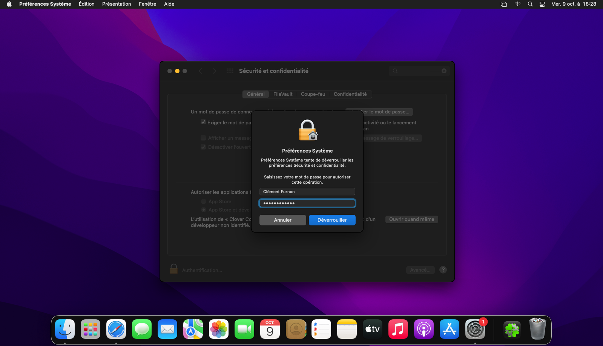
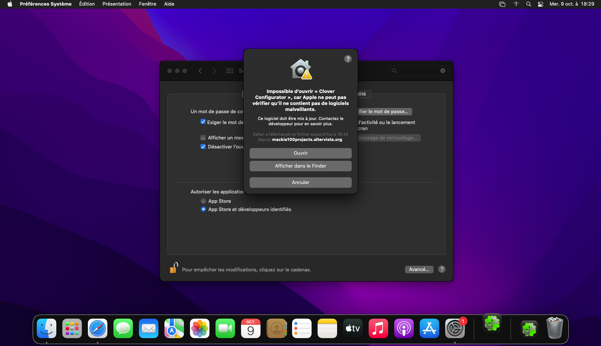
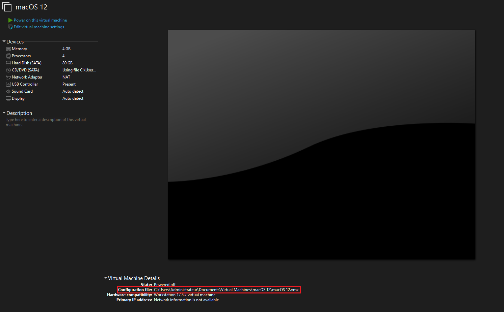

# Modifications Post-Installation
## Désactiver les mises à jour automatiques
Cliquez sur **Préférences Système**.
  

  
Cliquez sur **Mise à jour de logiciels**.
  

  
Décochez **Mettre à jour automatiquement mon Mac**, puis cliquez sur **Avancé**.
  

  
Décochez **Rechercher les mises à jour**, entrez le mot de passe, puis cliquez sur **Déverrouiller**.
  

  
Cliquez sur **OK**.
  

  
## Faire fonctionner le Mac App Store
Dans Safari, recherchez **Clover Configurator**, puis cliquez sur le lien approprié.  
Téléchargez ensuite **Clover Configurator**.
  

  
Ouvrez **Clover Configurator** que vous venez de télécharger.
  

  
Cliquez sur **OK**.
  

  
Cliquez sur **Préférences Système**.
  

  
Cliquez sur **Sécurité et confidentialité**.
  

  
Cliquez sur le cadenas verrouillé.
  

  
Entrez le mot de passe, puis cliquez sur **Déverrouiller**.
  

  
Cliquez sur **Ouvrir quand même**.
  

  
Cliquez sur **Ouvrir**.
  

  
Dans **SMBIOS**, cliquez sur les "deux flèches".
  

  
Sélectionnez **iMacPro1,1**.
  

  
Dans la section **System** > **Serial Number**, cliquez sur **Generate New**, puis copiez le **Serial Number** et le **Board Serial Number**.
  

  
Dans **Rt Variables**, cliquez sur **Generate**, puis copiez le **MLB** et le **ROM**.
  

  
Fermez, puis cliquez sur **Supprimer**.
  

  
Faites un clic droit sur le logo Apple, puis sélectionnez **Éteindre**.
  

  
Fermez VMware, puis rendez-vous dans le dossier de la VM, que vous pouvez retrouver ici :
  

  
Une fois dans le dossier de la VM, ouvrez le fichier `.vmx` à l'aide d'un éditeur de texte.

* Ajouter ces lignes : 
  
`cpuid.brandstring = "Intel(R) Xeon(R) W-2140B CPU @ 3.20GHz"`  
`serialNumber.reflectHost = "FALSE"`  
`serialNumber = "AAA"`  
`smbios.reflectHost = "FALSE"`  
`efi.nvram.var.ROM.reflectHost = "FALSE"`  
`efi.nvram.var.MLB.reflectHost = "FALSE"`  
`efi.nvram.var.ROM = "BBB"`  
`efi.nvram.var.MLB = "CCC"`  
`svga.vramSize = "2147483648"`  
`mainMem.useNamedFile = "FALSE"`  
`MemTrimRate = "0"`  
`sched.mem.pshare.enable = "FALSE"`  
`prefvmx.useRecommendedLockedMemSize = "TRUE"`  
  
Avec **AAA** représentant le `Serial Number`, **BBB** représentant le `ROM number` et CCC représentant le `Board Serial Number` ou `MLB number`.  
  
* Recherchez (Ctrl + F) et supprimez cette ligne : `smbios.reflectHost = "TRUE"`   
* Recherchez (Ctrl + F) `ethernet0.addressType = "generated"` et changez par `ethernet0.addressType = to "static"`.  
* Recherchez (Ctrl + F) `ethernet0.generatedAddressOffset = "0"` et changez par `ethernet0.checkMACAddress = "false"`.
* Recherchez (Ctrl + F) `ethernet0.generatedAddress = "xx:xx:xx:xx:xx:xx"` et remplacez-la par `ethernet0.Address = "FFF"` où FFF est une adresse MAC que vous pouvez obtenir sur [ce site](https://hwaddress.com/company/apple-inc/).
  